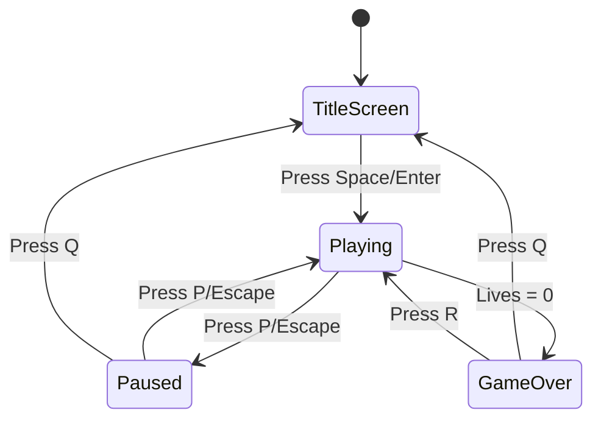

# Meteor Defender - Game Design Document

## Overview

**Meteor Defender** is a fast-paced arcade survival game where the player controls a spaceship at the bottom of the screen, defending Earth from waves of falling meteors. The game combines simple shooting mechanics with increasing difficulty, power-ups, and a satisfying visual style.

---

## Game Concept

### Core Premise
You are the last line of defense! Meteors are raining down from space, and it's your job to destroy them before they reach the bottom of the screen. Survive as long as possible while racking up a high score.

### Core Mechanics

1. **Player Movement**
   - The player's spaceship moves horizontally along the bottom of the screen
   - Smooth, responsive movement with keyboard controls

2. **Shooting**
   - Fire laser bullets upward to destroy meteors
   - Bullets travel in a straight line upward
   - Limited fire rate to add strategic element

3. **Meteor Waves**
   - Meteors fall from random positions at the top of the screen
   - Different meteor sizes with different properties:
     - **Small Meteors**: Fast, 1 hit to destroy, 10 points
     - **Medium Meteors**: Medium speed, 2 hits to destroy, 25 points
     - **Large Meteors**: Slow, 3 hits to destroy, 50 points
   - Meteors split when destroyed (large → 2 medium, medium → 2 small)

4. **Lives System**
   - Player starts with 3 lives
   - Lose a life when a meteor reaches the bottom
   - Game over when all lives are lost

5. **Difficulty Progression**
   - Meteors spawn faster over time
   - Meteor speed gradually increases
   - More large meteors appear in later waves

6. **Power-Ups** (occasional drops from destroyed meteors)
   - **Rapid Fire**: Double fire rate for 5 seconds
   - **Shield**: Absorbs one meteor hit
   - **Multi-Shot**: Fire 3 bullets at once for 5 seconds
   - **Extra Life**: Gain one life (rare)

---

## Controls

| Action | Key |
|--------|-----|
| Move Left | `A` or `Left Arrow` |
| Move Right | `D` or `Right Arrow` |
| Shoot | `Space` or `Up Arrow` |
| Pause | `P` or `Escape` |
| Restart (Game Over) | `R` |
| Quit | `Q` (from menu) or close window |

---

## Visual Design

### Color Palette

```
Background:    Deep Space Blue (#0a0a1a)
Stars:         White (#ffffff) with varying alpha
Player Ship:   Cyan (#00ffff)
Laser Bullets: Yellow (#ffff00)
Small Meteor:  Orange (#ff6600)
Medium Meteor: Red-orange (#ff4400)
Large Meteor:  Dark Red (#cc2200)
Power-ups:     
  - Rapid Fire:  Green (#00ff00)
  - Shield:      Blue (#0088ff)
  - Multi-Shot:  Purple (#aa00ff)
  - Extra Life:  Pink (#ff00aa)
UI Text:       White (#ffffff)
Score:         Yellow (#ffff00)
Lives:         Red (#ff0000) hearts
```

### Visual Elements

1. **Background**
   - Dark blue gradient from top to bottom
   - Twinkling stars (small white circles with random alpha)
   - Stars slowly drift downward for parallax effect

2. **Player Ship**
   - Simple triangle shape pointing upward
   - Cyan color with subtle glow effect
   - Small engine flame animation when moving

3. **Meteors**
   - Irregular polygon shapes (5-8 vertices)
   - Rotation animation while falling
   - Crack overlay showing damage state
   - Explosion particle effect when destroyed

4. **Bullets**
   - Small elongated rectangles
   - Yellow with slight trail effect
   - Travel upward at constant speed

5. **Power-ups**
   - Small circles with icons inside
   - Pulsing glow animation
   - Float downward slowly

6. **UI Elements**
   - Score in top-left corner
   - Lives displayed as heart icons in top-right
   - Current wave number in top-center
   - Active power-up indicators below score

### Screen Layout

```
┌────────────────────────────────────────┐
│  SCORE: 1250        WAVE 5      ❤️❤️❤️  │
│                                        │
│      ★    ★         ★                  │
│   ★        ★    ★       ★    ★        │
│        ★          ★         ★          │
│                                        │
│            ○ ← Meteor                  │
│         ◉ ← Power-up                   │
│                                        │
│                                        │
│           ▲ ← Player Ship              │
└────────────────────────────────────────┘
```

---

## Game States



### State Descriptions

1. **Title Screen**
   - Game title with animated meteor background
   - High score display
   - Press Space to start prompt
   - Controls summary

2. **Playing**
   - Active gameplay
   - All game mechanics active
   - Real-time score updates

3. **Paused**
   - Game frozen
   - Pause menu overlay
   - Options: Resume, Quit to Title

4. **Game Over**
   - Final score display
   - High score notification if achieved
   - Options: Restart, Quit to Title

---

## File Structure

```
pygame_game/
├── main.py           # Entry point, game initialization, main loop
├── game.py           # Game class, state management, core logic
├── player.py         # Player ship class
├── meteor.py         # Meteor class with size variants
├── bullet.py         # Bullet class
├── powerup.py        # Power-up class
├── particles.py      # Particle effects for explosions
├── constants.py      # All game constants and colors
└── design.md         # This design document
```

### Alternative: Single File Structure

For simpler implementation, everything can be combined into a single `main.py` file:

```
pygame_game/
├── main.py           # Complete game in single file
└── design.md         # This design document
```

---

## Implementation Notes

### Key Classes

1. **Game**
   - Manages game state
   - Handles event loop
   - Coordinates all game objects
   - Tracks score, lives, wave number

2. **Player**
   - Position, movement speed
   - Shooting cooldown
   - Active power-up states
   - Render method

3. **Meteor**
   - Size enum (SMALL, MEDIUM, LARGE)
   - Health points based on size
   - Fall speed based on size
   - Rotation angle for animation
   - Split method for spawning smaller meteors

4. **Bullet**
   - Position, velocity
   - Collision detection with meteors

5. **PowerUp**
   - Type enum
   - Position, fall speed
   - Effect application

6. **ParticleSystem**
   - Manages explosion particles
   - Update and render methods

### Game Loop Structure

```python
def game_loop():
    while running:
        # 1. Handle Events
        handle_events()
        
        # 2. Update Game State
        update_player()
        update_bullets()
        update_meteors()
        update_powerups()
        update_particles()
        check_collisions()
        spawn_meteors()
        
        # 3. Render
        render_background()
        render_game_objects()
        render_ui()
        
        # 4. Maintain Frame Rate
        clock.tick(60)
```

### Collision Detection

- Use pygame's `Rect` for simple AABB collision
- Bullet-Meteor: Rectangle vs Circle approximation
- Meteor-Bottom: Meteor bottom edge crosses screen boundary
- Player-PowerUp: Rectangle collision

### Difficulty Scaling

```python
# Pseudocode for difficulty progression
spawn_delay = max(0.5, 2.0 - (wave * 0.1))  # Seconds between spawns
meteor_speed = 2.0 + (wave * 0.2)            # Base fall speed
large_meteor_chance = min(0.3, wave * 0.02)  # Probability of large meteor
```

---

## Assets

All assets are generated programmatically - no external files needed.

### Shapes Generated in Code

1. **Player Ship**: Triangle polygon
   ```python
   points = [
       (x, y - 20),      # Top point
       (x - 15, y + 15), # Bottom left
       (x + 15, y + 15)  # Bottom right
   ]
   ```

2. **Meteors**: Irregular polygons
   - Generate random vertices around a center
   - Number of vertices based on size
   - Rotate over time

3. **Stars**: Small circles with random alpha
   - Pre-generate list of star positions
   - Vary size (1-3 pixels) and brightness

4. **Power-ups**: Circles with letter icons
   - R for Rapid Fire
   - S for Shield
   - M for Multi-Shot
   - + for Extra Life

### Sound Effects (Optional)

If sound is desired, simple beeps can be generated using pygame's sound synthesis or placeholder sounds can be used:
- Shoot: Short high-pitched beep
- Explosion: Low rumble
- Power-up: Ascending chime
- Game Over: Descending tone

---

## Scoring System

| Action | Points |
|--------|--------|
| Destroy Small Meteor | 10 |
| Destroy Medium Meteor | 25 |
| Destroy Large Meteor | 50 |
| Collect Power-up | 20 |
| Wave Completion Bonus | wave × 100 |

**High Score**: Stored in memory for session (no file persistence required for initial version)

---

## Future Enhancements (Post-MVP)

1. **Persistent High Scores**: Save to local file
2. **Sound Effects**: Add audio feedback
3. **Background Music**: Looping space-themed track
4. **Boss Meteors**: Large meteors with special patterns
5. **Combo System**: Bonus points for rapid destructions
6. **Unlockable Ships**: Different player ship designs
7. **Mobile Support**: Touch controls for mobile play

---

## Summary

Meteor Defender is designed to be:
- **Simple**: Easy to understand mechanics
- **Engaging**: Progressive difficulty keeps players challenged
- **Satisfying**: Visual feedback for all actions
- **Replayable**: High score chase and power-up variety

The game can be implemented in a single Python file (~300-400 lines) or split across multiple files for better organization. All visuals are generated programmatically, eliminating the need for external assets while still providing an appealing aesthetic.
