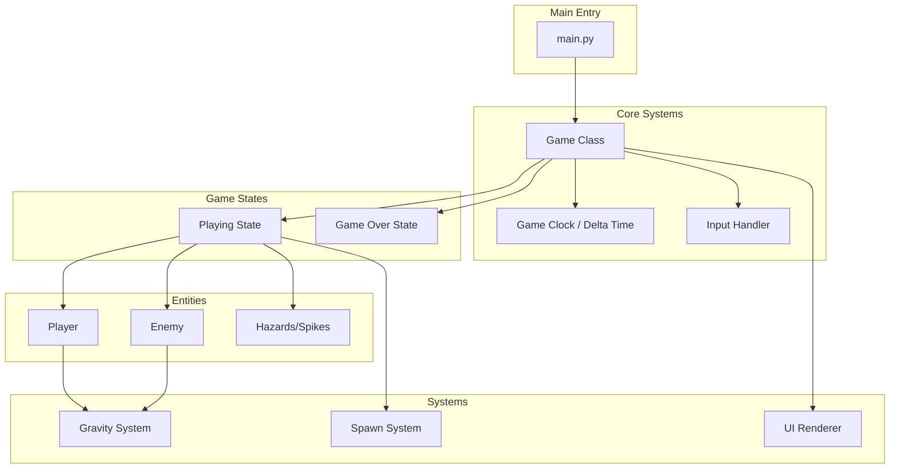
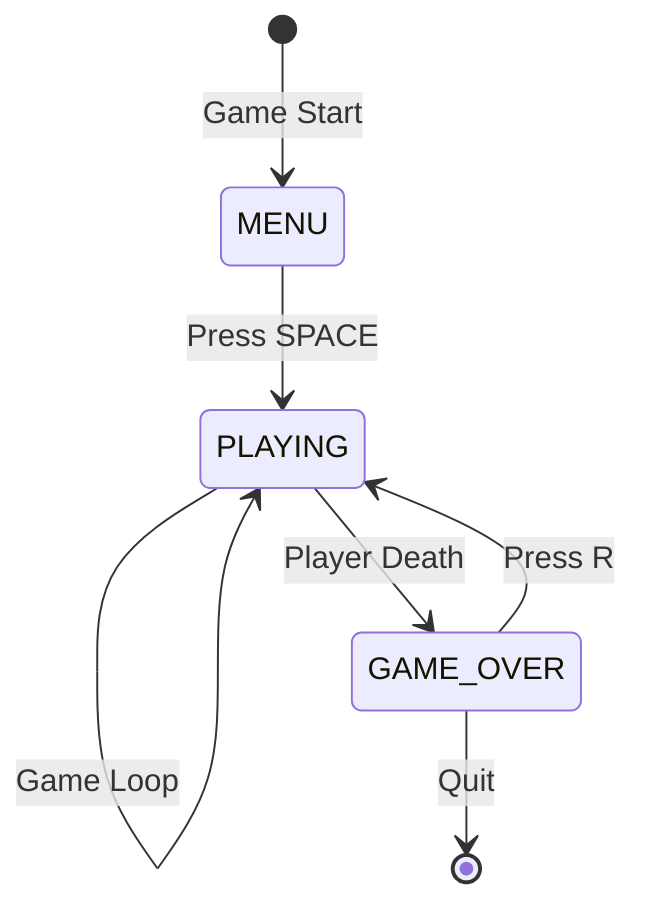

# Gravity Flip Arena - Development Plan

## 1. Architecture Overview

Gravity Flip Arena is a 2D arena survival game built with Pygame. The architecture follows an Object-Oriented Programming (OOP) approach with a clear separation of concerns between game entities, state management, and the main game loop.

### High-Level System Design



### Core Architecture Principles

1. **Single File Implementation**: All game code resides in one file (`main.py`) for simplicity unless modular separation becomes necessary
2. **OOP Structure**: Minimum three classes - `Player`, `Enemy`, `Game`
3. **Delta Time Movement**: All movement calculations use delta time for frame-rate independence
4. **State Pattern**: Game states manage different game modes (playing, game over)
5. **Global Gravity**: A single gravity variable affects all entities uniformly

---

## 2. Class List and Responsibilities

### 2.1 Player Class

**Purpose**: Represents the player character with movement, gravity flipping, and energy management.

#### Attributes

| Attribute | Type | Description |
|-----------|------|-------------|
| `rect` | `pygame.Rect` | Player position and dimensions |
| `velocity_y` | `float` | Vertical velocity for gravity/physics |
| `speed` | `float` | Horizontal movement speed in pixels/second |
| `color` | `tuple` | RGB color - neon cyan `(0, 255, 255)` |
| `energy` | `float` | Current energy level (0-100) |
| `max_energy` | `float` | Maximum energy capacity |
| `energy_regen_rate` | `float` | Energy regeneration per second |
| `gravity_flip_cost` | `float` | Energy cost per gravity flip |
| `is_alive` | `bool` | Player alive state |

#### Methods

| Method | Parameters | Returns | Description |
|--------|------------|---------|-------------|
| `__init__` | `x, y, width, height` | None | Initialize player at position |
| `update` | `dt, keys, gravity` | None | Update position, handle input, apply physics |
| `handle_input` | `keys` | None | Process left/right movement input |
| `apply_gravity` | `dt, gravity` | None | Apply gravity force to vertical velocity |
| `flip_gravity` | None | `bool` | Attempt gravity flip, return success |
| `draw` | `surface` | None | Render player rectangle |
| `check_collision` | `rect` | `bool` | Check collision with another rect |
| `take_damage` | None | None | Handle player death |

---

### 2.2 Enemy Class

**Purpose**: Represents enemy entities that chase the player and are affected by gravity.

#### Attributes

| Attribute | Type | Description |
|-----------|------|-------------|
| `rect` | `pygame.Rect` | Enemy position and dimensions |
| `velocity_y` | `float` | Vertical velocity for gravity/physics |
| `speed` | `float` | Horizontal chase speed in pixels/second |
| `color` | `tuple` | RGB color - red `(255, 0, 0)` |
| `is_stunned` | `bool` | Whether enemy is stunned from gravity flip |
| `stun_duration` | `float` | How long stun lasts in seconds |
| `stun_timer` | `float` | Current stun countdown |

#### Methods

| Method | Parameters | Returns | Description |
|--------|------------|---------|-------------|
| `__init__` | `x, y, width, height` | None | Initialize enemy at spawn position |
| `update` | `dt, player_rect, gravity` | None | Update position, chase player, apply gravity |
| `chase_player` | `dt, player_rect` | None | Move horizontally toward player |
| `apply_gravity` | `dt, gravity` | None | Apply gravity force to vertical velocity |
| `stun` | None | None | Apply stun effect from gravity flip |
| `draw` | `surface` | None | Render enemy rectangle |
| `check_collision` | `rect` | `bool` | Check collision with another rect |

---

### 2.3 Game Class

**Purpose**: Main game controller managing state, entities, rendering, and game loop.

#### Attributes

| Attribute | Type | Description |
|-----------|------|-------------|
| `screen` | `pygame.Surface` | Main display surface |
| `clock` | `pygame.time.Clock` | Game clock for FPS control |
| `running` | `bool` | Main loop running flag |
| `state` | `str` | Current game state |
| `player` | `Player` | Player instance |
| `enemies` | `list` | List of active Enemy instances |
| `gravity` | `int` | Current gravity direction (1 or -1) |
| `score` | `float` | Survival time in seconds |
| `spawn_timer` | `float` | Time since last enemy spawn |
| `spawn_interval` | `float` | Current spawn interval |
| `base_spawn_interval` | `float` | Initial spawn interval |
| `min_spawn_interval` | `float` | Minimum spawn interval |
| `screen_shake` | `float` | Screen shake intensity |
| `spike_height` | `int` | Height of spike zones |

#### Methods

| Method | Parameters | Returns | Description |
|--------|------------|---------|-------------|
| `__init__` | None | None | Initialize Pygame and game state |
| `run` | None | None | Main game loop entry point |
| `handle_events` | None | None | Process pygame events |
| `update` | `dt` | None | Update all game logic |
| `render` | None | None | Render all game elements |
| `spawn_enemy` | None | None | Create new enemy at random position |
| `flip_gravity` | None | None | Handle global gravity flip |
| `check_collisions` | None | None | Check all collision scenarios |
| `check_spike_collision` | None | None | Check player/enemy vs spikes |
| `game_over` | None | None | Transition to game over state |
| `restart` | None | None | Reset game to initial state |
| `draw_spikes` | None | None | Render floor and ceiling spikes |
| `draw_ui` | None | None | Render score, energy bar |
| `draw_game_over` | None | None | Render game over screen |

---

### 2.4 Optional: Spike Class (if needed)

**Purpose**: Represents spike hazards on floor and ceiling.

#### Attributes

| Attribute | Type | Description |
|-----------|------|-------------|
| `rect` | `pygame.Rect` | Spike zone position and dimensions |
| `position` | `str` | "floor" or "ceiling" |

#### Methods

| Method | Parameters | Returns | Description |
|--------|------------|---------|-------------|
| `__init__` | `position, screen_width, height` | None | Initialize spike zone |
| `draw` | `surface` | None | Render spike triangles |
| `check_collision` | `rect` | `bool` | Check collision with entity |

---

## 3. State Management Structure

### Game States



### State Definitions

| State | Description | Transitions |
|-------|-------------|-------------|
| `menu` | Initial start screen | SPACE → playing |
| `playing` | Active gameplay | death → game_over |
| `game_over` | Death screen with score | R → playing (restart) |

### State Management Implementation

```python
# Simple string-based state management
class Game:
    def __init__(self):
        self.state = "menu"  # menu, playing, game_over
    
    def handle_events(self):
        for event in pygame.event.get():
            if event.type == pygame.QUIT:
                self.running = False
            
            if event.type == pygame.KEYDOWN:
                if self.state == "menu" and event.key == pygame.K_SPACE:
                    self.state = "playing"
                elif self.state == "game_over" and event.key == pygame.K_r:
                    self.restart()
                    self.state = "playing"
                elif self.state == "playing" and event.key == pygame.K_SPACE:
                    self.flip_gravity()
```

---

## 4. Main Loop Breakdown

### Pseudocode Structure

```
FUNCTION main():
    INITIALIZE pygame
    CREATE game instance
    CALL game.run()

FUNCTION Game.run():
    WHILE running:
        # Calculate delta time
        dt = clock.tick(60) / 1000.0  # Convert ms to seconds
        
        # Handle events
        CALL handle_events()
        
        # State-specific logic
        IF state == "menu":
            CALL render_menu()
        
        ELSE IF state == "playing":
            # Update
            CALL update(dt)
            
            # Check collisions
            CALL check_collisions()
            
            # Render
            CALL render()
        
        ELSE IF state == "game_over":
            CALL draw_game_over()
        
        # Update display
        pygame.display.flip()

FUNCTION Game.update(dt):
    # Update score
    score += dt
    
    # Update player
    keys = pygame.key.get_pressed()
    player.update(dt, keys, gravity)
    
    # Update enemies
    FOR each enemy in enemies:
        enemy.update(dt, player.rect, gravity)
    
    # Spawn enemies
    spawn_timer += dt
    IF spawn_timer >= spawn_interval:
        spawn_enemy()
        spawn_timer = 0
        DECREASE spawn_interval  # Difficulty scaling
    
    # Regenerate energy
    player.energy = MIN(player.energy + player.energy_regen_rate * dt, player.max_energy)
    
    # Decay screen shake
    screen_shake *= 0.9

FUNCTION Game.render():
    # Apply screen shake offset
    offset_x = random(-screen_shake, screen_shake)
    offset_y = random(-screen_shake, screen_shake)
    
    # Clear screen
    screen.fill(BLACK)
    
    # Draw spikes
    draw_spikes()
    
    # Draw player
    player.draw(screen)
    
    # Draw enemies
    FOR each enemy in enemies:
        enemy.draw(screen)
    
    # Draw UI
    draw_ui()
```

### Frame Rate Management

```python
# Target 60 FPS with delta time
clock = pygame.time.Clock()
dt = clock.tick(60) / 1000.0  # Returns milliseconds, convert to seconds

# Movement with delta time
self.rect.x += self.speed * dt  # Speed is in pixels per second
```

---

## 5. Data Structures

### Primary Data Structures

#### Game Configuration Constants

```python
# Screen
SCREEN_WIDTH = 800
SCREEN_HEIGHT = 600
FPS = 60

# Colors
BLACK = (0, 0, 0)
WHITE = (255, 255, 255)
NEON_CYAN = (0, 255, 255)
RED = (255, 0, 0)
GREEN = (0, 255, 0)

# Player
PLAYER_WIDTH = 40
PLAYER_HEIGHT = 40
PLAYER_SPEED = 300  # pixels per second
PLAYER_ENERGY_MAX = 100
PLAYER_ENERGY_REGEN = 15  # per second
GRAVITY_FLIP_COST = 25

# Physics
GRAVITY_FORCE = 800  # pixels per second squared
TERMINAL_VELOCITY = 500

# Enemy
ENEMY_WIDTH = 30
ENEMY_HEIGHT = 30
ENEMY_BASE_SPEED = 150
ENEMY_STUN_DURATION = 0.5  # seconds

# Spawning
BASE_SPAWN_INTERVAL = 3.0  # seconds
MIN_SPAWN_INTERVAL = 0.5
SPAWN_DECREASE_RATE = 0.1  # decrease per spawn

# Spikes
SPIKE_HEIGHT = 20
SPIKE_COUNT = 20  # per row

# Screen Shake
SHAKE_INTENSITY = 10
SHAKE_DECAY = 0.9
```

#### Entity Lists

```python
# Active enemies list
enemies = []  # List[Enemy]

# Player reference
player = Player(x, y, width, height)
```

#### Game State Variables

```python
# State
state = "menu"  # str: "menu", "playing", "game_over"
running = True  # bool

# Gravity
gravity = 1  # int: 1 (down) or -1 (up)

# Score
score = 0.0  # float: survival time in seconds

# Spawning
spawn_timer = 0.0  # float
spawn_interval = 3.0  # float

# Effects
screen_shake = 0.0  # float
```

### Collision Detection Structure

```python
# Spike collision zones
floor_spike_rect = pygame.Rect(0, SCREEN_HEIGHT - SPIKE_HEIGHT, SCREEN_WIDTH, SPIKE_HEIGHT)
ceiling_spike_rect = pygame.Rect(0, 0, SCREEN_WIDTH, SPIKE_HEIGHT)

# Collision checks
def check_collisions():
    # Player vs spikes
    if player.rect.colliderect(floor_spike_rect) or player.rect.colliderect(ceiling_spike_rect):
        game_over()
    
    # Player vs enemies
    for enemy in enemies:
        if player.rect.colliderect(enemy.rect):
            game_over()
    
    # Enemies vs spikes (remove if hit)
    for enemy in enemies[:]:  # Copy list for safe removal
        if enemy.rect.colliderect(floor_spike_rect) or enemy.rect.colliderect(ceiling_spike_rect):
            enemies.remove(enemy)
```

---

## 6. Order of Implementation

### Phase 1: Core Setup

| Step | Task | Description |
|------|------|-------------|
| 1.1 | Project Setup | Create `gravity_flip_arena/` directory and `main.py` |
| 1.2 | Pygame Initialization | Initialize Pygame, create display, set up clock |
| 1.3 | Constants Definition | Define all game constants (colors, sizes, speeds) |
| 1.4 | Basic Game Loop | Create main loop with event handling and display flip |

### Phase 2: Player Implementation

| Step | Task | Description |
|------|------|-------------|
| 2.1 | Player Class Skeleton | Create Player class with rect and basic attributes |
| 2.2 | Player Movement | Implement horizontal movement with delta time |
| 2.3 | Player Gravity | Implement gravity application and vertical velocity |
| 2.4 | Player Rendering | Draw player rectangle on screen |
| 2.5 | Player Bounds | Keep player within screen boundaries |

### Phase 3: Gravity System

| Step | Task | Description |
|------|------|-------------|
| 3.1 | Global Gravity Variable | Implement gravity direction variable (1 or -1) |
| 3.2 | Gravity Flip Method | Create method to flip gravity direction |
| 3.3 | Energy System | Add energy meter with cost for flipping |
| 3.4 | Energy Regeneration | Implement energy regeneration over time |
| 3.5 | Input Binding | Bind SPACE key to gravity flip action |

### Phase 4: Hazards (Spikes)

| Step | Task | Description |
|------|------|-------------|
| 4.1 | Spike Zones | Define floor and ceiling spike rectangles |
| 4.2 | Spike Rendering | Draw spike triangles on floor and ceiling |
| 4.3 | Spike Collision | Detect player collision with spikes |
| 4.4 | Death on Spike Hit | Trigger game over on spike collision |

### Phase 5: Enemy System

| Step | Task | Description |
|------|------|-------------|
| 5.1 | Enemy Class Skeleton | Create Enemy class with rect and attributes |
| 5.2 | Enemy Gravity | Apply gravity to enemies |
| 5.3 | Enemy Chase AI | Implement horizontal movement toward player |
| 5.4 | Enemy Rendering | Draw enemy rectangles on screen |
| 5.5 | Enemy Collision | Detect player-enemy collision |
| 5.6 | Enemy Spike Death | Remove enemies that hit spikes |

### Phase 6: Spawning System

| Step | Task | Description |
|------|------|-------------|
| 6.1 | Spawn Timer | Implement timer for enemy spawning |
| 6.2 | Spawn Method | Create method to spawn enemies at edges |
| 6.3 | Difficulty Scaling | Decrease spawn interval over time |
| 6.4 | Enemy Stun | Stun enemies briefly on gravity flip |

### Phase 7: Game State Management

| Step | Task | Description |
|------|------|-------------|
| 7.1 | State Variable | Add state variable for game states |
| 7.2 | Menu State | Create simple start menu |
| 7.3 | Playing State | Active gameplay state |
| 7.4 | Game Over State | Death screen with final score |
| 7.5 | Restart Function | Reset game on R key press |

### Phase 8: UI and Polish

| Step | Task | Description |
|------|------|-------------|
| 8.1 | Score Display | Show survival time on screen |
| 8.2 | Energy Bar | Draw energy bar below player or in corner |
| 8.3 | Game Over Screen | Display final score and restart prompt |
| 8.4 | Screen Shake | Add screen shake effect on gravity flip |
| 8.5 | Final Testing | Test all features and balance difficulty |

---

## 7. Additional Technical Notes

### Physics Calculations

```python
# Gravity acceleration
velocity_y += GRAVITY_FORCE * gravity * dt

# Terminal velocity cap
velocity_y = max(-TERMINAL_VELOCITY, min(TERMINAL_VELOCITY, velocity_y))

# Position update
rect.y += velocity_y * dt

# Ground collision (when gravity is normal)
if rect.bottom >= SCREEN_HEIGHT - SPIKE_HEIGHT:
    rect.bottom = SCREEN_HEIGHT - SPIKE_HEIGHT
    velocity_y = 0

# Ceiling collision (when gravity is flipped)
if rect.top <= SPIKE_HEIGHT:
    rect.top = SPIKE_HEIGHT
    velocity_y = 0
```

### Screen Shake Implementation

```python
def render():
    # Calculate shake offset
    if screen_shake > 0.5:
        offset_x = random.uniform(-screen_shake, screen_shake)
        offset_y = random.uniform(-screen_shake, screen_shake)
    else:
        offset_x = offset_y = 0
    
    # Apply offset to all rendering
    # ... render with offset ...
    
    # Decay shake
    screen_shake *= SHAKE_DECAY
```

### Enemy Spawn Position Logic

```python
def spawn_enemy():
    # Spawn from left or right edge
    side = random.choice(["left", "right"])
    
    if side == "left":
        x = -ENEMY_WIDTH
    else:
        x = SCREEN_WIDTH
    
    # Spawn at random vertical position
    y = random.randint(SPIKE_HEIGHT + 50, SCREEN_HEIGHT - SPIKE_HEIGHT - 50 - ENEMY_HEIGHT)
    
    enemy = Enemy(x, y, ENEMY_WIDTH, ENEMY_HEIGHT)
    enemies.append(enemy)
```

---

## 8. File Structure

```
gravity_flip_arena/
├── DEVELOPMENT_PLAN.md    # This planning document
└── main.py                # All game code (single file implementation)
```

**Note**: Single file implementation is chosen for simplicity. If the codebase grows significantly, consider splitting into:
- `constants.py` - Game constants
- `player.py` - Player class
- `enemy.py` - Enemy class
- `game.py` - Game class and main loop
- `main.py` - Entry point

---

## 9. Success Criteria

The implementation will be considered complete when:

1. ✅ Player can move left/right smoothly
2. ✅ Player can flip gravity with SPACE (costs energy)
3. ✅ Energy regenerates over time
4. ✅ Enemies spawn and chase the player
5. ✅ Enemies are affected by gravity
6. ✅ Enemies are stunned briefly on gravity flip
7. ✅ Spikes on floor and ceiling kill player and enemies
8. ✅ Score tracks survival time
9. ✅ Game over screen displays with restart option
10. ✅ Game runs at 60 FPS with smooth delta time movement
11. ✅ Screen shake effect on gravity flip
12. ✅ Spawn rate increases over time for difficulty scaling
