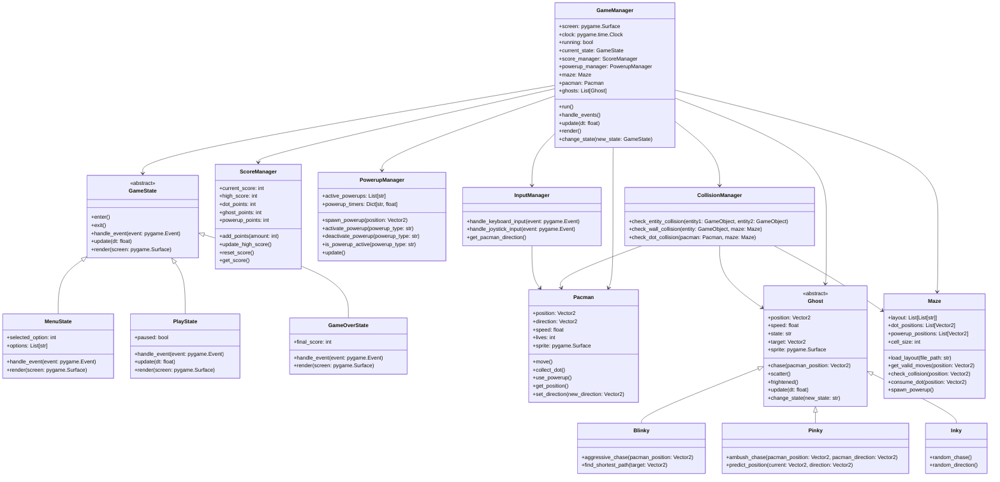
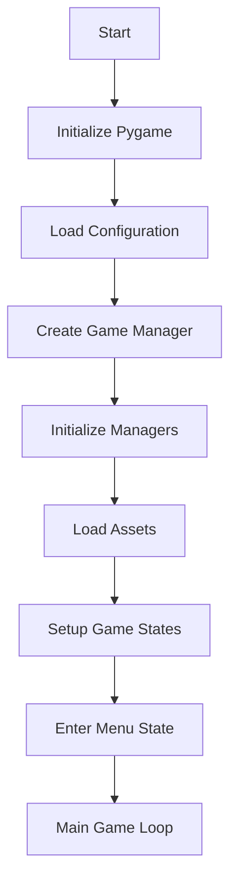
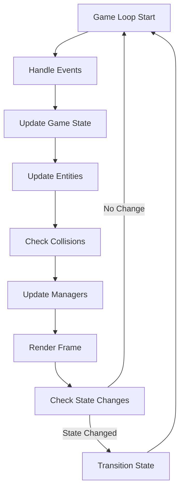
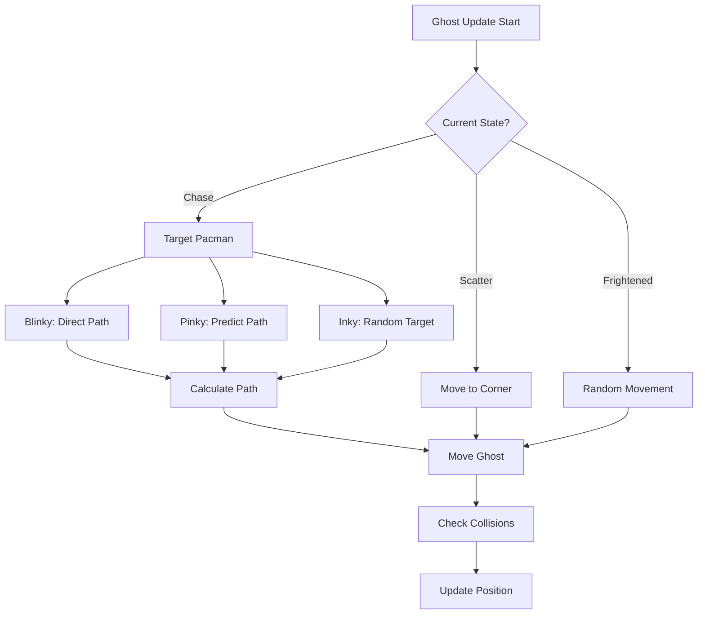
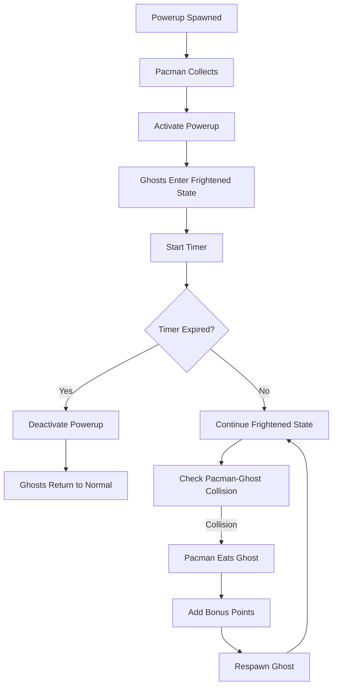
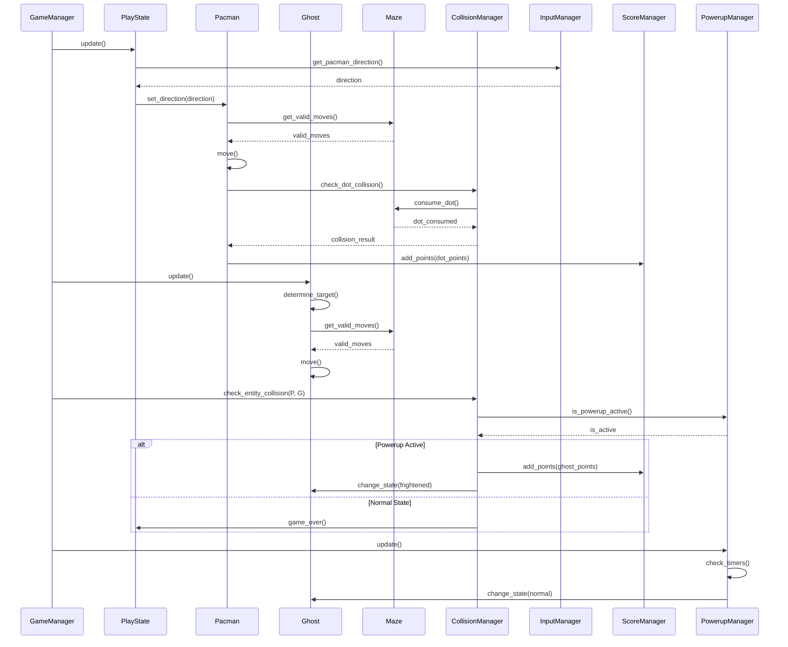

# Pacman Game Architecture Diagram

## Class Diagram

## System Workflow

### Game Initialization Flow

### Main Game Loop

### Ghost AI Decision Flow

### Powerup System Flow

## Component Interaction Diagram

## Implementation Priority

1. **Core Game Loop**: GameManager, GameState system
2. **Player System**: Pacman movement and controls
3. **Maze System**: Layout loading and collision detection
4. **Basic Ghost AI**: Simple movement patterns
5. **Scoring System**: Points tracking
6. **Advanced Ghost AI**: Unique behaviors for each ghost
7. **Powerup System**: Collection and activation logic
8. **Visual Polish**: Sprites, animations, UI

## Technical Considerations

### Performance Optimization
- **Pathfinding**: Use A* algorithm for ghost pathfinding
- **Collision Detection**: Spatial partitioning for efficient checks
- **Rendering**: Sprite batching and layer management

### Memory Management
- **Object Pooling**: Reuse ghost and powerup objects
- **Asset Caching**: Load and cache all sprites at startup
- **State Cleanup**: Properly clean up game objects on state change

This architecture diagram provides a comprehensive visual representation of the Pacman game system, showing class relationships, system workflows, and component interactions.