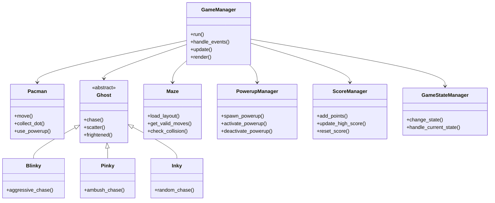

# Pacman Game Development Plan

## Overview
This document outlines the comprehensive development plan for a Pacman game using Python and Pygame. The game will feature classic Pacman gameplay with modern enhancements including unique ghost AI behaviors and a powerup system.

## Architecture Analysis from Existing Projects

Based on the analysis of your existing game projects (Arcade Games and Space Invaders), I've identified the following architecture patterns:

1. **Component-Based Design**: Separation of game entities into distinct components
2. **State Management**: Game state handling similar to your `GameStateManager` class
3. **Entity-Component System**: Base game objects with specialized entities
4. **Manager Pattern**: Separate managers for collision, input, scoring, etc.

## Game Requirements

### Core Features
- **Player Control**: Arrow keys for movement
- **Ghost AI**: 3 ghosts with unique behaviors
- **Powerups**: Collectible items activated with Enter key
- **Maze System**: Classic Pacman maze layout
- **Scoring System**: Points for dots, ghosts, and powerups
- **Game States**: Menu, Play, Game Over, Victory

### Technical Specifications
- **Language**: Python 3.x
- **Framework**: Pygame
- **Resolution**: 800x600 (scalable)
- **Controls**: Arrow keys (movement), Enter (powerup activation)

## Architecture Design

### Component Structure



### Directory Structure

```
pacman/
├── main.py                  # Entry point
├── constants.py             # Game constants
├── assets/                  # Game assets
│   ├── images/              # Sprites and graphics
│   └── sounds/              # Sound effects (future)
├── src/
│   ├── base/                # Base classes
│   │   ├── game_object.py   # Base game object
│   │   └── sprite_object.py # Base sprite object
│   ├── entities/            # Game entities
│   │   ├── pacman.py        # Pacman player
│   │   ├── ghosts/          # Ghost implementations
│   │   │   ├── blinky.py    # Blinky ghost
│   │   │   ├── pinky.py     # Pinky ghost
│   │   │   └── inky.py      # Inky ghost
│   │   └── powerup.py       # Powerup entity
│   ├── game/                # Game management
│   │   ├── game_manager.py  # Main game manager
│   │   ├── game_state.py    # Game state base
│   │   └── states/          # Game states
│   │       ├── menu_state.py
│   │       ├── play_state.py
│   │       ├── game_over_state.py
│   │       └── victory_state.py
│   ├── managers/            # Game managers
│   │   ├── collision_manager.py
│   │   ├── input_manager.py
│   │   ├── score_manager.py
│   │   └── powerup_manager.py
│   └── maze/                # Maze system
│       ├── maze.py          # Maze logic
│       └── maze_loader.py   # Maze layout loader
└── tests/                   # Unit tests
```

## Implementation Plan

### Phase 1: Foundation (2-3 days)
- [ ] Set up project structure
- [ ] Create base classes (GameObject, SpriteObject)
- [ ] Implement GameStateManager
- [ ] Create basic game loop
- [ ] Set up input handling system

### Phase 2: Core Gameplay (3-4 days)
- [ ] Implement Pacman player with movement
- [ ] Create maze system with collision detection
- [ ] Develop basic ghost AI (random movement)
- [ ] Implement dot collection and scoring
- [ ] Create game states (menu, play, game over)

### Phase 3: Advanced Features (2-3 days)
- [ ] Implement unique ghost AI behaviors:
  - Blinky: Aggressive chaser (direct path to Pacman)
  - Pinky: Ambush predator (predicts Pacman's path)
  - Inky: Random patroller (unpredictable movement)
- [ ] Develop powerup system with Enter key activation
- [ ] Add ghost vulnerability during powerup
- [ ] Implement scoring for eating vulnerable ghosts

### Phase 4: Polish and Testing (2 days)
- [ ] Balance ghost difficulty and speeds
- [ ] Test powerup timing and effects
- [ ] Optimize collision detection
- [ ] Add visual feedback for powerups
- [ ] Implement high score system

## Technical Details

### Ghost AI Behaviors

```python
class Blinky(Ghost):
    def chase(self, pacman_position):
        # Direct pathfinding to Pacman's current position
        return self.find_shortest_path(pacman_position)

class Pinky(Ghost):
    def chase(self, pacman_position, pacman_direction):
        # Predict Pacman's future position based on direction
        predicted_position = self.predict_position(pacman_position, pacman_direction)
        return self.find_shortest_path(predicted_position)

class Inky(Ghost):
    def chase(self):
        # Random movement with occasional targeting
        if random.random() < 0.3:  # 30% chance to target Pacman
            return self.find_shortest_path(pacman_position)
        else:
            return self.random_direction()
```

### Powerup System

```python
class PowerupManager:
    def __init__(self):
        self.active_powerups = []
        self.powerup_timers = {}

    def activate_powerup(self, powerup_type):
        if powerup_type == "ghost_vulnerability":
            self.active_powerups.append(powerup_type)
            self.powerup_timers[powerup_type] = time.time() + 10  # 10 seconds

    def update(self):
        current_time = time.time()
        for powerup in list(self.active_powerups):
            if current_time > self.powerup_timers[powerup]:
                self.deactivate_powerup(powerup)

    def is_powerup_active(self, powerup_type):
        return powerup_type in self.active_powerups
```

## Timeline Estimate

| Phase | Duration | Key Deliverables |
|-------|----------|------------------|
| 1. Foundation | 2-3 days | Project structure, base classes, game loop |
| 2. Core Gameplay | 3-4 days | Pacman movement, maze, basic ghosts, scoring |
| 3. Advanced Features | 2-3 days | Unique ghost AI, powerup system |
| 4. Polish & Testing | 2 days | Balancing, testing, visual polish |
| **Total** | **9-12 days** | Complete Pacman game |

## Risk Assessment

1. **Ghost AI Complexity**: Unique behaviors may require additional time for balancing
2. **Collision Detection**: Maze-based collision may need optimization
3. **Performance**: Multiple ghosts and pathfinding could impact performance

## Next Steps

1. Review and approve this development plan
2. Begin Phase 1: Foundation implementation
3. Set up version control and project tracking
4. Create initial asset placeholders

## Approval

Please review this comprehensive plan and let me know if you would like any modifications or if you're ready to proceed with implementation.