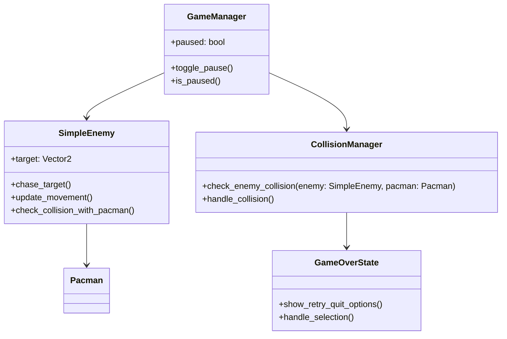

# Pacman Game - Updated Implementation Plan

## New Requirements Focus

Based on your feedback, I'm updating the implementation plan to focus on these specific features:

### Core New Features
1. **Simple Chasing AI Enemy** - Enemy that follows and attacks Pacman
2. **Collision Detection** - Detect when enemy catches Pacman
3. **Game Over System** - "You die" message with retry/quit options
4. **Pause Functionality** - Escape key pauses all movement

## Updated Architecture

### Class Diagram Additions



### System Workflow Updates

```mermaid
flowchart TD
    A[Game Start] --> B[Spawn Pacman and Enemy]
    B --> C[Main Game Loop]
    C --> D{Check Input}
    D -->|Escape| E[Toggle Pause]
    E -->|Paused| F[Stop All Movement]
    E -->|Unpaused| C
    D -->|Arrow Keys| G[Move Pacman]
    G --> H[Update Enemy Chase]
    H --> I{Check Collision?}
    I -->|Yes| J[Game Over]
    I -->|No| C
    J --> K[Show "You Die" Message]
    K --> L[Show Retry/Quite Options]
    L --> M{Player Choice}
    M -->|Retry| B
    M -->|Quit| N[Exit Game]
```

## Implementation Plan

### Phase 1: Simple AI Enemy (1 day)

#### Tasks:
- [ ] Create `SimpleEnemy` class extending `SpriteObject`
- [ ] Implement basic chasing algorithm
- [ ] Add enemy spawning in `PlayState`
- [ ] Implement enemy movement logic
- [ ] Create enemy rendering (red rectangle)

#### Code Structure:
```python
class SimpleEnemy(SpriteObject):
    def __init__(self, position, target):
        super().__init__(position, (30, 30), (255, 0, 0))  # Red enemy
        self.target = target
        self.speed = 2.0

    def chase_target(self, target_position):
        # Simple direction calculation
        direction = Vector2(target_position) - Vector2(self.position)
        if direction.length() > 0:
            direction = direction.normalize()
        return direction * self.speed

    def update(self, dt, pacman_position):
        if not self.game_manager.is_paused():
            direction = self.chase_target(pacman_position)
            self.position += direction * dt
```

### Phase 2: Collision Detection (0.5 day)

#### Tasks:
- [ ] Implement collision detection in `CollisionManager`
- [ ] Add collision handling logic
- [ ] Create game over trigger
- [ ] Test collision accuracy

#### Code Structure:
```python
class CollisionManager:
    def check_enemy_collision(self, enemy, pacman):
        # Simple bounding box collision
        enemy_rect = pygame.Rect(enemy.position, enemy.size)
        pacman_rect = pygame.Rect(pacman.position, pacman.size)
        return enemy_rect.colliderect(pacman_rect)

    def handle_collision(self, game_manager):
        game_manager.change_state(GameOverState())
```

### Phase 3: Game Over System (0.5 day)

#### Tasks:
- [ ] Create enhanced `GameOverState`
- [ ] Add "You die" message display
- [ ] Implement retry/quit options
- [ ] Add selection navigation
- [ ] Test game over flow

#### Code Structure:
```python
class GameOverState(GameState):
    def __init__(self):
        super().__init__()
        self.selected_option = 0  # 0: Retry, 1: Quit
        self.options = ["Retry", "Quit"]

    def render(self, screen):
        # Draw "You Die" message
        font = pygame.font.SysFont('Arial', 48)
        title = font.render("You Die", True, (255, 0, 0))
        screen.blit(title, (screen.get_width()//2 - title.get_width()//2, 100))

        # Draw options
        for i, option in enumerate(self.options):
            color = (255, 255, 0) if i == self.selected_option else (255, 255, 255)
            text = font.render(option, True, color)
            screen.blit(text, (screen.get_width()//2 - text.get_width()//2, 200 + i * 60))

    def handle_event(self, event):
        if event.type == pygame.KEYDOWN:
            if event.key == pygame.K_UP:
                self.selected_option = (self.selected_option - 1) % len(self.options)
            elif event.key == pygame.K_DOWN:
                self.selected_option = (self.selected_option + 1) % len(self.options)
            elif event.key == pygame.K_RETURN:
                if self.selected_option == 0:  # Retry
                    return PlayState()
                else:  # Quit
                    return None  # Signal to quit game
```

### Phase 4: Pause Functionality (0.5 day)

#### Tasks:
- [ ] Add pause state to `GameManager`
- [ ] Implement pause toggle on Escape key
- [ ] Stop all entity movement when paused
- [ ] Add pause overlay display
- [ ] Test pause/resume functionality

#### Code Structure:
```python
class GameManager:
    def __init__(self):
        self.paused = False
        # ... other init code

    def toggle_pause(self):
        self.paused = not self.paused
        print(f"Game {'paused' if self.paused else 'resumed'}")

    def is_paused(self):
        return self.paused

    def handle_events(self, events):
        for event in events:
            if event.type == pygame.KEYDOWN and event.key == pygame.K_ESCAPE:
                self.toggle_pause()
            # ... other event handling
```

## Updated Implementation Timeline

| Phase | Duration | Focus |
|-------|----------|-------|
| 1. Simple AI Enemy | 1 day | Basic chasing behavior |
| 2. Collision Detection | 0.5 day | Enemy-Pacman collision |
| 3. Game Over System | 0.5 day | "You die" + retry/quit |
| 4. Pause Functionality | 0.5 day | Escape key pause |
| **Total** | **2.5 days** | Complete new features |

## Integration with Existing Code

### Updates to GameManager
- Add `paused` state and toggle method
- Modify update loop to check pause state
- Add pause event handling

### Updates to PlayState
- Add enemy spawning and management
- Implement collision checking in update loop
- Add pause state handling

### Updates to InputManager
- Add Escape key handling for pause
- Ensure input propagation to game states

## Testing Plan

### Test Cases
1. **AI Chasing**: Enemy follows Pacman correctly
2. **Collision Detection**: Game over triggers on contact
3. **Game Over Flow**: Retry/quit options work properly
4. **Pause Functionality**: Escape key pauses/resumes correctly
5. **Movement Stop**: All entities stop when paused

### Test Scenarios
- Pacman moves away from enemy - enemy should chase
- Pacman lets enemy catch up - game over should trigger
- Press Escape during gameplay - all movement should stop
- Select retry after game over - new game should start
- Select quit after game over - game should exit

## Risk Assessment

### Potential Issues
1. **Collision Detection Accuracy** - May need bounding box adjustments
2. **Pause State Timing** - Ensure no movement during pause
3. **Game Over State Cleanup** - Proper reset on retry

### Mitigation
- Use visual debugging for collision boxes
- Add pause checks in all update methods
- Implement proper state cleanup methods

## Next Steps

1. Review and approve this updated implementation plan
2. Begin implementation with Phase 1: Simple AI Enemy
3. Test each component before proceeding to next phase
4. Integrate all features and perform comprehensive testing

This updated plan focuses specifically on your requested features while building upon the existing foundation. The implementation is designed to be completed in approximately 2.5 days with proper testing and integration.