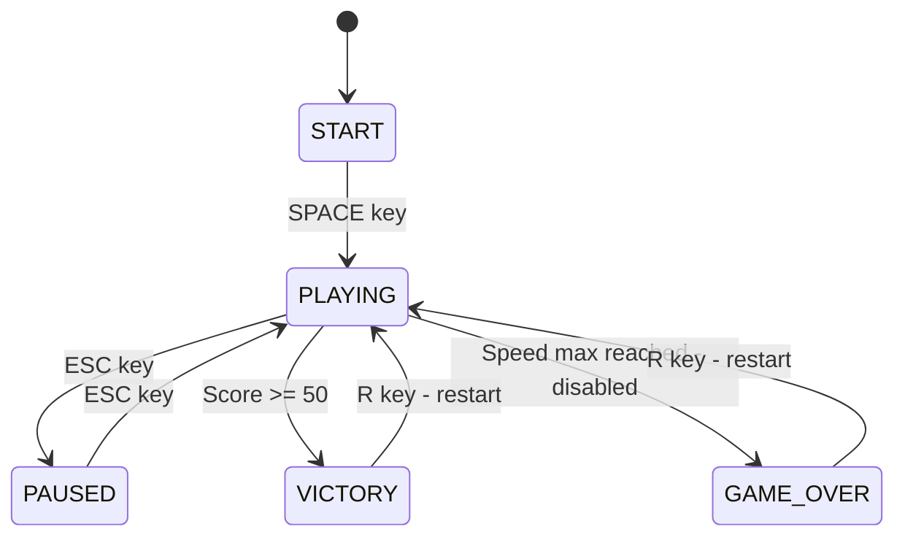
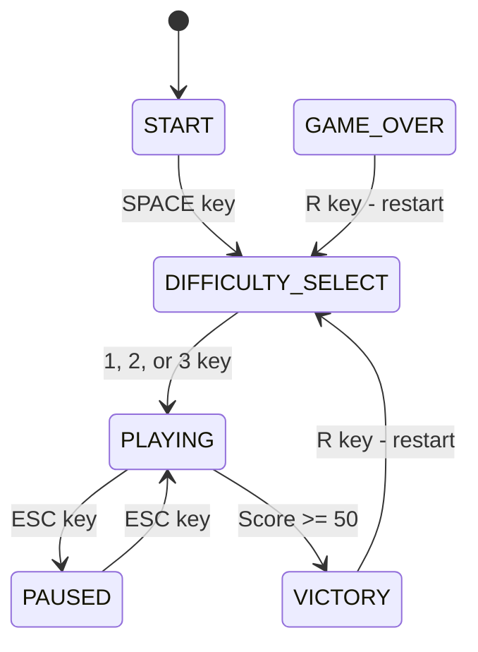

# Color Catch - Difficulty Selection Feature Design Document

## Overview

This document outlines the design for adding a difficulty selection screen to the Color Catch game. The difficulty selection screen will appear when the player clicks "Play" (presses SPACE) on the start screen, before the game begins.

## Difficulty Levels

| Difficulty | Enemy Speed | Dash Ability | Slowdown Ability |
|------------|-------------|--------------|------------------|
| Easy       | 50% slower  | Available    | Available        |
| Normal     | Current     | Available    | Available        |
| Hard       | Current     | Disabled     | Disabled         |

---

## Current Code Analysis

### Game Flow



### Key Files and Responsibilities

| File | Purpose |
|------|---------|
| [`constants.py`](color_catch/constants.py) | Game constants including speeds, cooldowns, dimensions |
| [`player.py`](color_catch/player.py) | Player movement and dash ability logic |
| [`target.py`](color_catch/target.py) | Target movement, speed management, slowdown effect |
| [`game.py`](color_catch/game.py) | Main game logic, state management, UI rendering |
| [`main.py`](color_catch/main.py) | Entry point, display setup, main loop |

### Current Constants - Relevant to Difficulty

From [`constants.py`](color_catch/constants.py:31-39):
```python
# Target settings
TARGET_WIDTH = 30
TARGET_HEIGHT = 30
TARGET_INITIAL_SPEED = 2

# Difficulty progression settings
SPEED_INCREASE_PERCENTAGE = 0.10  # 10% speed increase per collision
MAX_SPEED = 25.0  # Maximum speed cap

# Dash settings
DASH_SPEED = 25
DASH_COOLDOWN = 2.5
DASH_DURATION = 0.15
DASH_DISTANCE = 150

# Slowdown ability settings
SLOWDOWN_DURATION = 3.0
SLOWDOWN_COOLDOWN = 7.0
SLOWDOWN_PERCENTAGE = 0.5
```

### Current Game States

From [`constants.py`](color_catch/constants.py:60-65):
```python
START = "START"
PLAYING = "PLAYING"
GAME_OVER = "GAME_OVER"
VICTORY = "VICTORY"
PAUSED = "PAUSED"
```

### Ability Implementation Locations

**Dash Ability:**
- Player class: [`player.py:27-36`](color_catch/player.py:27-36) - Properties
- Player class: [`player.py:114-134`](color_catch/player.py:114-134) - `can_dash()` and `start_dash()` methods
- Game class: [`game.py:395-442`](color_catch/game.py:395-442) - `_draw_dash_indicator()` UI
- Game class: [`game.py:980-983`](color_catch/game.py:980-983) - SPACE key triggers dash

**Slowdown Ability:**
- Game class: [`game.py:44-47`](color_catch/game.py:44-47) - Properties
- Game class: [`game.py:444-497`](color_catch/game.py:444-497) - `_draw_slowdown_indicator()` UI
- Game class: [`game.py:1079-1117`](color_catch/game.py:1079-1117) - `_activate_slowdown()` and `_update_slowdown()`
- Target class: [`target.py:30-40`](color_catch/target.py:30-40) - `set_slowdown()` method

---

## Implementation Plan

### Step 1: Add New Constants

**File:** [`constants.py`](color_catch/constants.py)

Add the following constants:

```python
# Difficulty settings
DIFFICULTY_EASY = "EASY"
DIFFICULTY_NORMAL = "NORMAL"
DIFFICULTY_HARD = "HARD"

# Difficulty speed multipliers
EASY_SPEED_MULTIPLIER = 0.5    # 50% slower enemies
NORMAL_SPEED_MULTIPLIER = 1.0  # Current speed
HARD_SPEED_MULTIPLIER = 1.0    # Same as normal

# Ability availability by difficulty
EASY_ABILITIES_ENABLED = True
NORMAL_ABILITIES_ENABLED = True
HARD_ABILITIES_ENABLED = False

# New game state for difficulty selection
DIFFICULTY_SELECT = "DIFFICULTY_SELECT"
```

### Step 2: Add Difficulty Configuration Class

**File:** [`constants.py`](color_catch/constants.py) or new file `difficulty.py`

Create a configuration class to encapsulate difficulty settings:

```python
class DifficultyConfig:
    """Configuration for a difficulty level"""
    def __init__(self, name, speed_multiplier, abilities_enabled, color):
        self.name = name
        self.speed_multiplier = speed_multiplier
        self.abilities_enabled = abilities_enabled
        self.color = color  # For UI display

# Difficulty configurations
DIFFICULTY_CONFIGS = {
    DIFFICULTY_EASY: DifficultyConfig(
        name="Easy",
        speed_multiplier=EASY_SPEED_MULTIPLIER,
        abilities_enabled=EASY_ABILITIES_ENABLED,
        color=GREEN
    ),
    DIFFICULTY_NORMAL: DifficultyConfig(
        name="Normal",
        speed_multiplier=NORMAL_SPEED_MULTIPLIER,
        abilities_enabled=NORMAL_ABILITIES_ENABLED,
        color=YELLOW
    ),
    DIFFICULTY_HARD: DifficultyConfig(
        name="Hard",
        speed_multiplier=HARD_SPEED_MULTIPLIER,
        abilities_enabled=HARD_ABILITIES_ENABLED,
        color=RED
    ),
}
```

### Step 3: Modify Game State Flow

**File:** [`game.py`](color_catch/game.py)

Update the game flow to include difficulty selection:



#### Changes to [`Game.__init__()`](color_catch/game.py:13-53)

Add difficulty tracking:
```python
# Difficulty settings
self.current_difficulty = DIFFICULTY_NORMAL  # Default
self.abilities_enabled = True  # Based on difficulty
```

#### Changes to [`handle_events()`](color_catch/game.py:957-996)

Add handling for difficulty selection state:
```python
elif self.game_state == DIFFICULTY_SELECT:
    if event.key == pygame.K_1:
        self._select_difficulty(DIFFICULTY_EASY)
    elif event.key == pygame.K_2:
        self._select_difficulty(DIFFICULTY_NORMAL)
    elif event.key == pygame.K_3:
        self._select_difficulty(DIFFICULTY_HARD)
```

#### New Method: `_select_difficulty()`

```python
def _select_difficulty(self, difficulty):
    """Set the selected difficulty and start the game"""
    self.current_difficulty = difficulty
    config = DIFFICULTY_CONFIGS[difficulty]
    self.abilities_enabled = config.abilities_enabled
    
    # Apply speed multiplier to target
    if self.target:
        self.target.speed_multiplier = config.speed_multiplier
    
    # Start the game
    self._start_game()
```

### Step 4: Modify Target Class for Speed Multiplier

**File:** [`target.py`](color_catch/target.py)

#### Changes to [`Target.__init__()`](color_catch/target.py:6-31)

Add base speed and multiplier:
```python
def __init__(self, x=None, y=None, speed_multiplier=1.0):
    # ... existing code ...
    self.base_speed = TARGET_INITIAL_SPEED
    self.speed = TARGET_INITIAL_SPEED * speed_multiplier
    self.speed_multiplier = speed_multiplier  # Store for respawn
```

#### Changes to [`_increase_speed()`](color_catch/target.py:195-208)

Apply multiplier when increasing speed:
```python
def _increase_speed(self):
    # Calculate new base speed
    new_base_speed = self.base_speed * (1 + SPEED_INCREASE_PERCENTAGE)
    self.base_speed = min(new_base_speed, MAX_SPEED)
    
    # Apply multiplier to actual speed
    self.speed = self.base_speed * self.speed_multiplier
    self.speed = min(self.speed, MAX_SPEED)
```

#### New Method: `set_speed_multiplier()`

```python
def set_speed_multiplier(self, multiplier):
    """Set the speed multiplier for difficulty adjustment"""
    self.speed_multiplier = multiplier
    self.speed = self.base_speed * multiplier
```

### Step 5: Modify Player Class for Ability Toggle

**File:** [`player.py`](color_catch/player.py)

#### Changes to [`Player.__init__()`](color_catch/player.py:7-36)

Add ability enabled flag:
```python
def __init__(self, x, y, abilities_enabled=True):
    # ... existing code ...
    self.abilities_enabled = abilities_enabled
```

#### Changes to [`can_dash()`](color_catch/player.py:114-117)

Check if abilities are enabled:
```python
def can_dash(self):
    """Check if player can dash (cooldown expired and abilities enabled)"""
    if not self.abilities_enabled:
        return False
    current_time = time.time()
    return current_time - self.last_dash_time >= DASH_COOLDOWN
```

### Step 6: Modify Game Class for Ability UI

**File:** [`game.py`](color_catch/game.py)

#### Changes to [`_draw_dash_indicator()`](color_catch/game.py:395-442)

Skip drawing if abilities disabled:
```python
def _draw_dash_indicator(self):
    """Draw dash cooldown indicator"""
    if not self.abilities_enabled:
        return  # Don't show in Hard mode
    # ... rest of existing code ...
```

#### Changes to [`_draw_slowdown_indicator()`](color_catch/game.py:444-497)

Skip drawing if abilities disabled:
```python
def _draw_slowdown_indicator(self):
    """Draw slowdown ability indicator"""
    if not self.abilities_enabled:
        return  # Don't show in Hard mode
    # ... rest of existing code ...
```

#### Changes to [`handle_events()`](color_catch/game.py:957-996)

Block ability keys when disabled:
```python
elif event.key == pygame.K_SPACE and self.game_state == PLAYING and not self.paused:
    # Handle dash - only if abilities enabled
    if self.abilities_enabled and self.player and self.player.can_dash():
        self.player.start_dash()
elif event.key == pygame.K_r and self.game_state == PLAYING and not self.paused:
    # Handle slowdown - only if abilities enabled
    if self.abilities_enabled:
        self._activate_slowdown()
```

### Step 7: Create Difficulty Selection Screen

**File:** [`game.py`](color_catch/game.py)

#### New Method: `render_difficulty_select_screen()`

```python
def render_difficulty_select_screen(self):
    """Render the difficulty selection screen"""
    # Draw background
    self._draw_start_background()
    
    # Title
    title_font = pygame.font.SysFont('Arial', 56, bold=True)
    title_text = title_font.render("Select Difficulty", True, YELLOW)
    title_rect = title_text.get_rect(center=(SCREEN_WIDTH // 2, 100))
    self.screen.blit(title_text, title_rect)
    
    # Difficulty options
    options_font = pygame.font.SysFont('Arial', 36)
    options = [
        (DIFFICULTY_EASY, "1. Easy - Slower enemies, abilities available", GREEN),
        (DIFFICULTY_NORMAL, "2. Normal - Standard speed, abilities available", YELLOW),
        (DIFFICULTY_HARD, "3. Hard - Standard speed, NO abilities", RED),
    ]
    
    for i, (diff_key, text, color) in enumerate(options):
        option_text = options_font.render(text, True, color)
        option_rect = option_text.get_rect(center=(SCREEN_WIDTH // 2, 220 + i * 60))
        self.screen.blit(option_text, option_rect)
    
    # Instructions
    inst_font = pygame.font.SysFont('Arial', 24)
    inst_text = inst_font.render("Press 1, 2, or 3 to select difficulty", True, WHITE)
    inst_rect = inst_text.get_rect(center=(SCREEN_WIDTH // 2, 450))
    self.screen.blit(inst_text, inst_rect)
    
    # Back option
    back_text = inst_font.render("Press ESC to go back", True, (150, 150, 150))
    back_rect = back_text.get_rect(center=(SCREEN_WIDTH // 2, 500))
    self.screen.blit(back_text, back_rect)
```

#### Changes to [`render()`](color_catch/game.py:164-205)

Add difficulty select rendering:
```python
def render(self):
    """Render game objects"""
    if self.game_state == START:
        self.render_start_screen()
        return
    elif self.game_state == DIFFICULTY_SELECT:
        self.render_difficulty_select_screen()
        return
    # ... rest of existing code ...
```

#### Changes to [`update()`](color_catch/game.py:68-110)

Add difficulty select state:
```python
def update(self):
    """Update game state"""
    if self.game_state == START:
        return
    if self.game_state == DIFFICULTY_SELECT:
        return  # No updates needed for difficulty select screen
    # ... rest of existing code ...
```

### Step 8: Update Start Screen Flow

**File:** [`game.py`](color_catch/game.py)

#### Changes to [`handle_events()`](color_catch/game.py:957-996)

Change START state to go to difficulty select:
```python
if self.game_state == START and event.key == pygame.K_SPACE:
    # Go to difficulty selection screen
    self.game_state = DIFFICULTY_SELECT
```

#### Changes to [`render_start_screen()`](color_catch/game.py:667-701)

Update instructions:
```python
start_text = start_font.render("Press SPACE to Play", True, GREEN)
```

### Step 9: Update Restart Logic

**File:** [`game.py`](color_catch/game.py)

#### Changes to [`_restart_game()`](color_catch/game.py:1004-1015)

Go back to difficulty select on restart:
```python
def _restart_game(self):
    """Restart the game by going to difficulty selection"""
    # Reset game state
    self.score = 0
    self.victory = False
    self.game_over = False
    self.max_speed_reached = False
    self.game_state = DIFFICULTY_SELECT  # Go to difficulty select
    
    # Reset slowdown state
    self.slowdown_active = False
    self.last_slowdown_time = -SLOWDOWN_COOLDOWN
    
    # Reinitialize game objects
    self._initialize_game_objects()
```

---

## Summary of Changes

### Files to Modify

| File | Changes |
|------|---------|
| [`constants.py`](color_catch/constants.py) | Add difficulty constants, state, and configuration class |
| [`player.py`](color_catch/player.py) | Add `abilities_enabled` parameter and check in `can_dash()` |
| [`target.py`](color_catch/target.py) | Add `speed_multiplier` and `set_speed_multiplier()` method |
| [`game.py`](color_catch/game.py) | Add difficulty state, selection screen, ability toggling |

### New Components

1. **DifficultyConfig class** - Encapsulates difficulty settings
2. **DIFFICULTY_SELECT state** - New game state for selection screen
3. **render_difficulty_select_screen()** - New rendering method
4. **_select_difficulty()** - New method to apply difficulty settings

### Modified Components

1. **Game flow** - START → DIFFICULTY_SELECT → PLAYING
2. **Target speed** - Multiplier applied based on difficulty
3. **Ability indicators** - Hidden when abilities disabled
4. **Ability activation** - Blocked when abilities disabled
5. **Restart behavior** - Returns to difficulty select

---

## Testing Considerations

1. **Easy Mode Testing:**
   - Verify targets move at 50% speed
   - Verify both dash and slowdown work
   - Verify UI shows both ability indicators

2. **Normal Mode Testing:**
   - Verify targets move at current speed
   - Verify both abilities work
   - Verify behavior matches current game

3. **Hard Mode Testing:**
   - Verify targets move at normal speed
   - Verify dash indicator is hidden
   - Verify slowdown indicator is hidden
   - Verify SPACE does not trigger dash
   - Verify R does not trigger slowdown

4. **State Transition Testing:**
   - START → DIFFICULTY_SELECT → PLAYING
   - VICTORY → DIFFICULTY_SELECT
   - ESC from DIFFICULTY_SELECT → START

---

## Visual Mockup

```
┌─────────────────────────────────────────────────────────────┐
│                                                             │
│                   Select Difficulty                         │
│                                                             │
│         1. Easy - Slower enemies, abilities available       │
│                       [GREEN]                               │
│                                                             │
│         2. Normal - Standard speed, abilities available     │
│                       [YELLOW]                              │
│                                                             │
│         3. Hard - Standard speed, NO abilities              │
│                        [RED]                                │
│                                                             │
│                                                             │
│           Press 1, 2, or 3 to select difficulty             │
│                                                             │
│                   Press ESC to go back                      │
│                                                             │
└─────────────────────────────────────────────────────────────┘
```

---

## Implementation Order

1. Add constants to [`constants.py`](color_catch/constants.py)
2. Modify [`target.py`](color_catch/target.py) for speed multiplier
3. Modify [`player.py`](color_catch/player.py) for ability toggle
4. Add difficulty selection screen to [`game.py`](color_catch/game.py)
5. Update game state flow in [`game.py`](color_catch/game.py)
6. Update ability UI rendering in [`game.py`](color_catch/game.py)
7. Test all three difficulty modes
